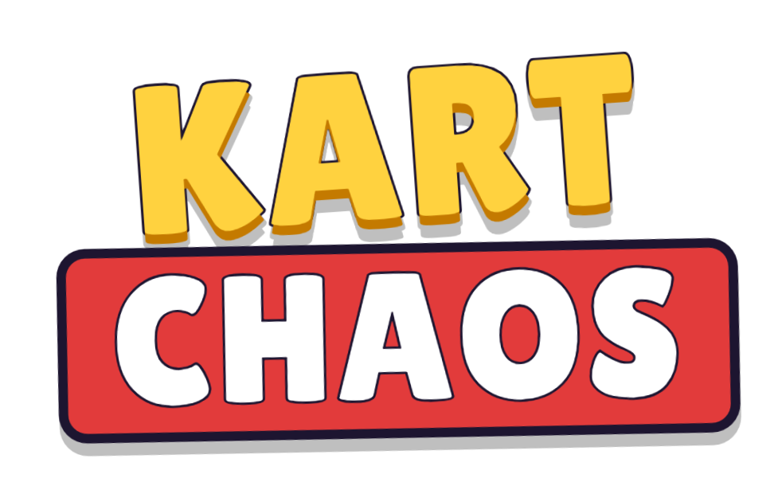
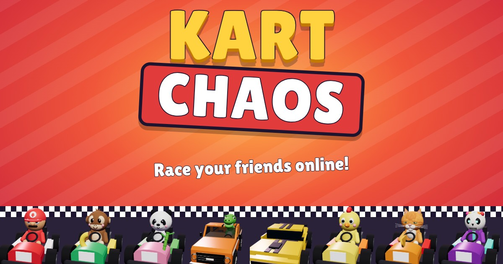

<p align="center">
  
</p>

<p align="center">A 3D kart racer that runs right in your browser.<br>
Race CPUs in the Chamo Cup, chase the record holders' ghosts, or race your friends online with voice chat.</p>

<p align="center"><a href="https://kartchaos.com/"><b>▶ Play now at kartchaos.com</b></a></p>

<p align="center"></p>

## Features

- **Grand Prix:** race the 5-track Chamo Cup at 50cc, 100cc, 150cc or 200cc and win a trophy.
- **8 tracks:** the Chamo Cup's Chamo Circuit, Cactus Canyon, Snowy Peak, Sunshine Beach and Neon Nights, plus Mars Aliens (a low-gravity run across Mars with flying saucers and aliens), Miami Vice (a night race along Ocean Drive and over the bay, with neon, go-fast boats and a thunderstorm) and Zoo City (a zoo in the city, with animals in their enclosures along the track).
- **Versus:** single races with your own rules (track, laps, speed class, items).
- **Time Trial:** three laps with three mushrooms, against any mix of ghosts: your own best run, the lap record (its record lap, replayed every lap) and the track record (the fastest full race). Press R (or tap ↻) to restart instantly. Send your best run to a friend as a 👻 ghost challenge link.
- **Best times:** global top 10s per track for the fastest lap and the fastest full race. You hear about it (in the game, or by notification) when someone beats your time.
- **Daily Challenge:** one track, racer, kart and speed class a day, the same for everyone, with a daily board of best 3-lap times.
- **Online multiplayer:** public and private rooms of up to 8 racers (CPUs fill the empty spots), lobby chat, in-race chat, voice chat over WebRTC and one-tap rematches. Invite friends to a room straight to WhatsApp.
- **Players online:** see who's playing, challenge them to a private race, or 👀 watch their race live (with chat and quick reactions).
- **8 racers and 3 karts:** Chamo, Momo, Bao, Lucas (a T-rex in a pickup truck), Bumblebee (press D to transform), Chicky, Dorito (a real orange tabby) and your own **Custom** racer, built in the editor from head to wheels. The karts are the Classic, Bullet and Buggy.
- **Every Mario Kart item:** bananas and shells (hold the item button to drag them behind you as a shield), the Blue Shell, mushrooms, the Star, Bullet Bill, Lightning, the Blooper, the Bob-omb, the Boo, the Super Horn and more.
- **Interactive tutorial:** a coach rides along on Chamo Circuit and teaches drifting, mini-turbos, items, boosters and ramp tricks.
- **Instant replay and share cards:** after Grand Prix, Versus and Online races, the best moments play back with TV cameras and slow motion, and 📸 Share makes a picture of your result for the group chat.
- **Drifting and tricks:** mini-turbos, rocket starts and ramp tricks.
- **Plays anywhere:** keyboard, gamepad or touch. On phones you can steer with the on-screen pad or by tilting the phone like a steering wheel. Add it to your home screen for full screen and notifications.
- **No assets to download:** the models, textures, music and sound effects are all generated in code (three.js and the Web Audio API).

## Controls

| Action | Keyboard | Gamepad | Touch |
| --- | --- | --- | --- |
| Accelerate | ↑ / W | A | automatic |
| Brake / reverse | ↓ / S | B | ◀◀ |
| Steer | ← → / A D | left stick / d-pad | pad or tilt |
| Hop & drift | Space / Shift | RB / RT | DRIFT |
| Use item | E / X | LB / LT | ITEM |
| Look behind | C | X | |
| Transform (Bumblebee) | D | | |
| Restart (Time Trial) | R | Back / Select | ↻ |
| Pause | Esc | Start | ❚❚ |

## Running it locally

The game is plain ES modules with no build step. three.js is loaded from a CDN.

```sh
# 1. Serve the files (any static server works)
python3 -m http.server 8000

# 2. For online play, start the multiplayer server
npm install
npm start            # listens on 127.0.0.1:8792 (set HOST / PORT to change)
```

Open <http://localhost:8000/>. To use a local multiplayer server, add `?server=ws://127.0.0.1:8792` to the URL.
By default the game connects to `ws(s)://<host>/<path>/ws`, so in production put a reverse proxy in front of the server:

```nginx
location = /ws {
    proxy_pass http://127.0.0.1:8792/;
    proxy_http_version 1.1;
    proxy_set_header Upgrade $http_upgrade;
    proxy_set_header Connection "upgrade";
    proxy_read_timeout 1h;
}
```

## Fastest-lap boards

Each Time Trial posts its lap times to the multiplayer server, which keeps each racer's best lap and the top 10 per track.
Players are identified by an anonymous id stored in their browser (`localStorage.ck_pid`), not by name.
The server rejects laps faster than `MIN_LAP_S` in `server.mjs`, which is about 15% under the theoretical best lap at 150cc.
Lap times come from the player's browser, though, so a determined cheater could still post a fake one.

The boards are saved to `$RECORDS_FILE`, or `$STATE_DIRECTORY/records.json`, or `./records.json` if neither is set.
In production, a systemd drop-in (`StateDirectory=kartchaos`) puts them at `/var/lib/kartchaos/records.json`.
Each board entry can also have a **ghost**: the whole Time Trial run its time came from (20 frames a second, about 45 KB, with its lap times). The game uploads it with the laps when the run could improve one of the player's entries. The server checks that it matches the lap times, keeps it in `$STATE_DIRECTORY/ghosts/` (`<track>-<player id>.json` for the lap board, `r<track>-<player id>.json` for the full-race board), and deletes it when the entry falls off the board. Asked for the lap board's ghost, the server sends just the record lap.

The server keeps the boards in memory, so to remove an entry, stop the service first:

```sh
systemctl stop kartchaos-ws
# edit /var/lib/kartchaos/records.json (entries are sorted by "time", fastest first)
systemctl start kartchaos-ws
```

## Players, challenges and notifications

While the game is open it keeps a light "presence" connection (`js/presence.js`) that shares the player's name, racer and status (menus, racing, online room). It drops after a minute in the background. The 👥 Players screen lists everyone online. **⚔️ Challenge** creates a private room and invites the other player. If they're mid-race, the invite waits until they finish, and it expires after 2 minutes.

Players are shown by a public id derived from their private `ck_pid`, so the private one never leaves the server.

**The Custom racer** (CHARACTERS index 7, `CUSTOM` in `js/look.js`) is built from a "look": a small object of choices (head, eyes, hat, colours, decals, stats…) saved in the player's settings. It travels with them everywhere others can see them: the `profile` and `presence` messages, room grids, spectator casts, board entries and ghosts. The server re-checks it with `cleanLook` (unknown options fall back to the defaults, and the stats must add up to 12, 1 to 5 each). A racer in that slot with no look, like the CPU, is Skully (`DEFAULT_LOOK`).

**👀 Watch** follows a player's races live. The watcher sends `{t:"watch", to: uid}` on its presence connection. While anyone is watching, the racer's game (`Broadcaster` in `js/spectate.js`) sends `cast` messages on its own presence connection: the grid once per race, then every kart ten times a second (`packKart`), the items on the road, events, and item box and coin changes. It sends nothing when nobody is watching. The server checks each message's shape (`cleanCast`) and passes it on to the watchers. The watcher's `SpectateSession` plays it back 0.3 s behind with the normal race view and HUD.

**Push notifications** (`push.mjs`, the `web-push` package and `sw.js`): players opt in on the Players screen. They're told when someone starts playing (at most once every 30 minutes, and not after a server restart) and when they're challenged while the game is closed. The server keeps its VAPID keys in `$STATE_DIRECTORY/vapid.json` and the subscriptions in `push.json`. Deleting `vapid.json` invalidates every subscription. On iPhone, push only works when the game was added to the Home Screen (`manifest.json`).

## Daily Challenge

`js/daily.js` picks each day's challenge from the UTC date, so every player gets the same one without asking the server.
It shuffles the tracks in blocks (one day per track), so each track comes up once per block and never two days running.
Each new track starts a new era in `ERAS` from the day after it ships (Mars Aliens on 2026-09-27; Miami Vice and Zoo City both on 2026-09-28); earlier days keep their rotation so their boards stay valid.
The server imports the same file to check that a submitted run belongs to today's challenge (or yesterday's, for 15 minutes after midnight).

- **Boards:** the server keeps each player's best 3-lap time per day in `$DAILY_FILE`, or `$STATE_DIRECTORY/daily.json` (`/var/lib/kartchaos/daily.json` in production). It keeps the last 8 days.
- **Checks:** each run needs 3 laps that add up to the total time, and every lap must be at least `MIN_LAP_S` for the track, scaled by the day's speed class. As with the fastest-lap boards, a determined cheater could still post a fake time.
- **Editing:** as with `records.json`, stop `kartchaos-ws` before you edit `daily.json`.

## Stats page

`/dashboard/` is a private dashboard that shows each player's visits, races, results, IP address and location.
nginx protects it with basic auth, using the password file `/etc/nginx/kartchaos-stats.htpasswd`.
To add or change a login, run `htpasswd -B /etc/nginx/kartchaos-stats.htpasswd <user>`.
On the tailnet it needs no password: `https://<this machine's tailnet name>:8443/chamokart/dashboard/`. `tailscale serve --https=8443` proxies that to a localhost-only nginx site, `/etc/nginx/sites-available/kartchaos-tailnet`.

- **What the game reports:** a `hello` on every load (with where the visit came from), each finished Grand Prix, Versus or Time Trial race, each finished cup, and a few key moments (`event`: tutorial started or finished, notifications on, share, invite, watch…). Each report goes over a short-lived WebSocket.
- **Traffic sources:** links the game shares carry `?s=invite`, `?s=share` or `?s=ghost`, so a visit from WhatsApp still says where it came from. Otherwise it's `utm_source` or the referring site, and "direct" when there's none. The game removes the tag from the address bar.
- **Tabs:** 📈 Analytics, 📥 Inbox (feedback, bugs and ideas, with a red count of what needs you), 👥 Players and 🏆 All time. The tab is in the URL (`#analytics`, `#inbox`, `#players`, `#all-time`). Older links like `#feedback`, `#bugs`, `#bug-12` and `#idea-3` open the Inbox.
- **📈 Analytics:** the first tab (`dashboard/analytics.js`) works it all out in the browser from the daily records: visitors (new and returning) by day, week or month; daily, weekly and monthly active players; retention by first week; a weekday-by-hour heatmap; how far new players get; sources, countries, devices, key moments and the most active players. Filter by 7, 30 or 90 days or all time, and every chart has a table view.
- **Daily records:** kept for 400 days. Each day has its visits, races and the players who came. Since 2026-10-07 it also has visits by UTC hour, sessions and play time (how long the game was open, from the presence connection), sources, countries, devices, modes, tracks, key moments, races per player and the most players online at once.
- **Online races:** recorded by the server itself when each race ends.
- **Storage:** `$STATE_DIRECTORY/stats.json`, which is `/var/lib/kartchaos/stats.json` in production.
- **Location data:** comes from Cloudflare's request headers. `CF-Connecting-IP` and `CF-IPCountry` are always sent. City and region need Cloudflare's *Add visitor location headers* managed transform.
- **Data endpoint:** the page loads its data from `/dashboard/data`. nginx proxies that to `127.0.0.1:8792/stats`, behind the same password.

## Crash reports and Claude's fixes

The game reports its own uncaught errors (`js/crash.js`, a plain script that loads before the modules, so it also catches errors while they load).
It only reports errors from the game's own files, at most 5 per page load, with the stack, what the player was doing (`window.ckCrashContext` in `main.js`) and the last taps and screens (`window.ckCrumb`).

`bugs.mjs` in the server groups the same error from the same place in the code into one bug, and keeps the latest 5 reports of each in `$STATE_DIRECTORY/bugs.json`.
They're listed under 🐞 Bugs on the dashboard. Devices with dashboard notifications on get a ping for each new bug.

**🔧 Fix with Claude** hands a bug to the fixer service (`/opt/kartchaos-fixer`, see its README):

1. Claude reproduces and fixes the bug in a locked-down copy of the game.
2. You review its report and diff, then approve, ask for changes, or reject.
3. An approved fix goes live, and deployed fixes can be rolled back.

## Feature ideas

Players post ideas and vote for them at `/features/` (`features/index.html`). The page talks to the server over the usual WebSocket (`ideas`, `idea` and `vote` messages).
`features.mjs` stores ideas in `$STATE_DIRECTORY/features.json`.

- **Who can take part:** only players the stats know (they've loaded the game on that device) can post or vote.
  - Each player can post 3 ideas a day, and 40 a day in total.
  - The author's own vote is counted automatically.
- **When an idea gets built:** once `VOTES_TO_BUILD` (2) different players back it, the fixer has Claude build it.
  - Voters on the same internet connection count once, going by a hash of their IP.
  - Behind Cloudflare, that IP comes from `CF-Connecting-IP`. nginx only passes that header on for requests that really come from Cloudflare (`/etc/nginx/conf.d/cloudflare-ips.conf`).
- **Automatic build limits:** at most 3 ideas a day are built automatically, and each idea only once. Anything else you start with **🔧 Build now** on the dashboard.
- **After Claude builds it:** it adds a "What's new" entry, and you review the feature under 💡 Ideas on the dashboard. The page shows players where each idea stands: open, being built, being checked, live, or not planned.
- **Moderation:** hidden ideas disappear from the page and never get built.

## Hosting

The game lives at **https://kartchaos.com/**, behind Cloudflare. It used to be **Chamo Kart** at `jgrivera.com/chamokart/`. The server-side names were renamed on 2026-10-07 (the `kartchaos-ws` and `kartchaos-fixer` services, `/var/lib/kartchaos`, the stats password file); only the game's folder on the server is still `/var/www/jgrivera.com/chamokart`.

- **nginx:** `sites-available/kartchaos.com` serves the game directory at the root of the domain, with the rules in `snippets/kartchaos-game.conf` (`/ws`, `/migrate`, the dashboard, no-cache for the page and scripts, and 404s for the server's own files).
- **Search engines:** the game page can be indexed. `robots.txt` points to `sitemap.xml`, and the page has a canonical link, a description and VideoGame structured data (JSON-LD). The dashboard, `/migrate` and the features page send `X-Robots-Tag: noindex`. Google Search Console is where to submit the sitemap and request indexing.
- **The old address:** `jgrivera.com/chamokart/` serves `moved.html`. It hands the browser's saved data (everything in `localStorage` starting with `ck_`: the player id, settings, custom racer, ghosts…) to the server's one-time `/migrate` endpoint and forwards to `kartchaos.com/#import=<token>`, keeping room, ghost challenge and player links. The first script in `index.html` picks the data up there. Every other old URL redirects to the same path on kartchaos.com.
- **Links in notifications:** built from `SITE` in `server.mjs` (`SITE_URL`, default `https://kartchaos.com/`).

## Publishing a "What's new" update

Players see the **What's new** screen as soon as the game loads whenever `changelog.json` has an entry they haven't seen yet. They can also reopen it from the main menu. To announce an update, add an entry at the **top** of the list:

```json
{ "id": "2026-10-02", "title": "Short headline", "items": ["One change per line.", "Another change."] }
```

- `id` must be new for every update, because each browser remembers the last `id` it showed (`localStorage.ck_seenChangelog`). A `YYYY-MM-DD` id is also shown as the date. For a second update on the same day, use something like `2026-10-02b`.
- Fixing a typo in an existing entry keeps its `id`, so nobody sees the screen again.
- Entries added since a player's last visit get a NEW tag. The file is fetched fresh on every load, so no `?v=` bump is needed.

## How it's built

```
index.html        screens and HUD markup
changelog.json    "What's new" entries shown on load (newest first)
css/style.css     all styling (phones: portrait + landscape layouts)
js/main.js        app shell: menus, game flow, online lobby
js/game.js        a race session: ties the simulation, rendering, HUD and audio together
js/sim/           rendering-free simulation: tracks, kart physics, items, CPU drivers, race rules
js/view/          three.js world, kart models, procedural textures, particles, camera
js/audio.js       procedural chiptune music, synthesized sound effects and engines
js/net.js         WebSocket client with clock sync
js/records.js     fastest-lap and daily boards (one-off requests to the server)
js/daily.js       the daily challenge for a date (shared with server.mjs)
js/voice.js       WebRTC voice chat (the server only relays signaling)
server.mjs        rooms, lobbies, race orchestration, boards, ghosts and notifications (Node + ws)
push.mjs          web push notifications (records beaten, the Daily Challenge, challenges, "X is playing")
sw.js             service worker that shows the notifications
js/presence.js    who's playing: the always-on presence connection
js/replay.js      instant replay: records the race, picks the best moments, plays them back
js/spectate.js    watching a race live: the racer streams it, the watcher plays it back
js/tutorial.js    the interactive tutorial: steps, goals and the coach card (mode "tutorial" on Chamo Circuit)
moved.html        the old address's page: hands saved data to kartchaos.com
js/look.js        the Custom racer's look: options, validation (shared with server.mjs, keep it import-free)
js/view/custom.js builds the Custom racer's avatar and car dressing from a look
js/sharecard.js   the 📸 Share picture of a result (drawn on a canvas)
stats.mjs         player stats for the private stats page
bugs.mjs          crash reports grouped into bugs, for the dashboard
features.mjs      players' feature ideas and votes
features/         the public ideas page
js/crash.js       reports the game's uncaught errors (a plain script, loads first)
dashboard/        the stats dashboard (password-protected)
```

Each client simulates its own kart (and the host's CPUs); the server relays kart states and items, keeps the race clock and decides the official results.
